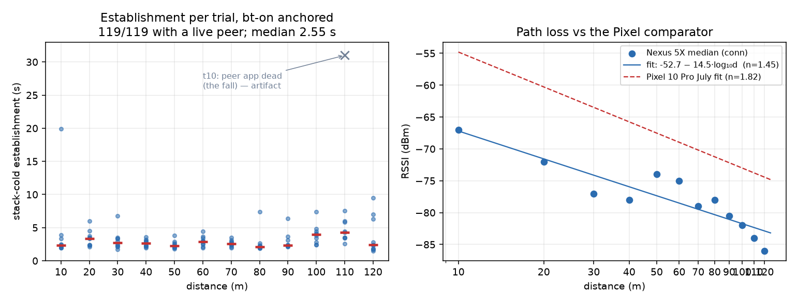

# nexus-line — the thesis line sweep on Nexus 5X (2026-08-22)

Two Nexus 5X, 12 positions 10–120 m, 10 trials a position, every trial
stack-cold (scripted 3 s radio-dark reset before each), 2 messages a trial in
each direction, operator full-stack reset on every walk between positions.
Same site, tripods and slate as the Pixel 10 Pro run (`line-field/`).
Data: survivor `exp_line-2` upload `3085171` (complete, 09:13:20–10:49:48 UTC),
fallen phone `exp_line-2` upload `210193` (restart at 120 m only, see The fall).
Analysis window ends at the survivor's `expStop` 10:49:48.

Anchor: `bt-on` marker. In this build the trial cadence stamps `links-reset`
and `bt-on` in the same second, so the numbers are directly comparable with
the Pixel run's `links-reset` anchor — the anchor caveat in PREDICTIONS.md
dissolves.

## Per-distance table (survivor side)

| d (m) | sessions | estab med (s) | estab max (s) | sent→acked | recv | RSSI med (dBm) | dial fails |
|---|---|---|---|---|---|---|---|
| 10 | 10/10 | 2.36 | 19.91 | 20→20 | 20 | −67 | 4 |
| 20 | 10/10 | 3.38 | 6.02 | 20→19 | 20 | −72 | 0 |
| 30 | 10/10 | 2.69 | 6.79 | 20→20 | 20 | −77 | 1 |
| 40 | 10/10 | 2.62 | 3.55 | 20→20 | 20 | −78 | 0 |
| 50 | 10/10 | 2.26 | 3.80 | 20→20 | 20 | −74 | 0 |
| 60 | 10/10 | 2.91 | 4.47 | 20→20 | 20 | −75 | 0 |
| 70 | 10/10 | 2.56 | 3.50 | 20→20 | 20 | −79 | 1 |
| 80 | 10/10 | 2.12 | 7.41 | 20→20 | 20 | −78 | 1 |
| 90 | 10/10 | 2.32 | 6.41 | 20→20 | 20 | −80.5 | 1 |
| 100 | 10/10 | 3.95 | 7.43 | 20→20 | 20 | −82 | 2 |
| 110 | 9/10* | 4.30 | 7.52 | 18→18 | 18 | −84 | 6 |
| 120 | 10/10† | 2.38 | 9.49 | 20→16 | 12 | −86 | 7 |

\* the 110 m miss is `t10` — the peer's app was already dead (the fall);
no radio at the far end. With a live peer the record is **119/119**.
† against the restarted peer, whose per-trial resets ran on an unsynchronized
schedule — see The fall.

All trials: estab median **2.55 s**, p90 5.87 s, max 19.91 s (that max is
d=10 t1, the first stack-cold establishment of the run). No 15-s reset mode
appeared in 119 stack-cold establishments — the outlier unit's historical
second mode did not reproduce under full-stack resets.

## Delivery

Message-id accounting on the survivor's file alone covers both directions
(its `ackRx` confirms its own sends; its `recv`+`ackTx` count the peer's).

* **Pre-fall, 10–110 m (109 pair-trials): fallen→survivor 218/218 = 100 %.
  Survivor→fallen 217/218 = 99.5 %** — the one loss is a d=20 t8 message
  (09:28:07) never acknowledged; with the peer's recording gone it cannot be
  split into message-lost vs ack-lost.
* 120 m, against the restarted peer: survivor→peer 16/20, peer→survivor 12/14
  (the peer's own file confirms 12/14 from its side). The shortfall is
  reset-schedule dead-air, not distance: each side was radio-dark ~5 s of
  every 35 s on schedules ~110 s apart, and a trial's unacked message does not
  outlive the trial's custody-reset. No SCF rescue is possible by design —
  trial isolation purges the buffer.

Control plane ~2.86 kB a trial median, flat with distance (Pixels: 3.1–3.4).
Survivor discharge median 424 mA (Pixels 204–233 — different hardware class
and screen, not comparable beyond "flat").

## Path loss

Median conn-RSSI per distance, OLS on log10(d), 12 points:

    RSSI(d) = −52.7 − 14.5·log10(d)   n = 1.45, σ = 2.3 dB

Pixels: −36.6 − 18.2·log10(d), n = 1.82, σ 3.2. The slopes differ, so the
intercept gap (16.1 dB) overstates the physical offset; at 60 m the fitted
curves sit 9.5 dB apart — inside the predicted 5–12 dB band. The Nexus reads
lower everywhere yet **keeps forming sessions at −86 dBm (120 m)**, where the
Pixels' cliff sat at −79: vendor RSSI scales are not absolute, and the
sensitivity floor clearly is not shared either.

## Predictions scorecard (PREDICTIONS.md, committed pre-run)

| # | prediction | verdict |
|---|---|---|
| 1 | n 1.7–2.3 | **missed low** — n = 1.45 (σ 2.3; nowhere near 3.2, arm valid) |
| 2 | A 5–12 dB below Pixel | **direction right**; 16 dB by intercept, 9.5 dB at 60 m — in-band at field distances |
| 3 | cliff at 70–100 m | **refuted** — no cliff through 120 m, 10/10 sessions at every live-peer distance |
| 4 | ≥80 % establishment at 10 m | ✓ 10/10 |
| 5 | slower than Pixel medians (2.3–6.9 s) | **refuted** — 2.1–4.3 s, same anchor |
| 6 | delivery ~100 % among established | ✓ 99.5 % pre-fall (one unresolved loss) |
| 7 | 00d98aa1 shows overruns/133s | **not testable** — its own recording died with the fall; pair establishment shows no 15-s mode in 119 resets |

Falsifiers: n did not land near 3 (arm valid); 10 m worked; all cross-device
joins are message-id based (clock-free).

## The fall

* d=110 t9 completes 10:40:40; last conn-RSSI from the peer 10:41:09; t10
  (10:41:13) sees 14 dials, zero discoveries — the peer fell and its app died
  ~10:41. Operator relaunched at the 120 m position: restart `expStart`
  10:43:49, pickers set to start=120, so its labels are true geometry.
* The restart run within the window: 7 trials, estab 2.0–25.7 s (the two >20 s
  are waits through the survivor's unsynchronized radio-dark windows, not
  stack cost), sent 14→12 acked, recv 16.
* **The fallen phone's pre-fall recording is gone.** The server holds zero
  records from it between 09:13 and 10:43 across all uploads; at relaunch its
  `line-2` id was free again, i.e. no flushed file existed despite the battery
  falling 100→76 % (four 5-%-drop flush thresholds). Everything since
  `expStart` lived in memory and died with the process.
* Both `line-1` files are a deliberate pre-field smoke test (d=1, 3 trials,
  08:22–08:27, ended by Finish-early). Excluded.

## Run-integrity notes

* Operator walk resets: every walk shows its bt cycle; doubles on the walks
  to 60 m (09:54:01, 09:54:16 — operator-reported) and to 100 m (10:26:14,
  10:26:20). Harmless: positions still open stack-cold.
* The deployed APK predates `d6f3a51`: the sweep pickers sent the default
  2 messages a trial — which is exactly what the July Pixel run sent (222 a
  side there), so load is held constant with the comparator. The
  `sendCount: 100` variant was never deployed; had it been, the arm would
  have lost comparability.
* Survivor `expStop` closes cleanly; restart closed by Finish-early 10:51:13
  (files kept). No `aborted` markers anywhere — the Abort path, which deletes
  the run's file, was never taken.

